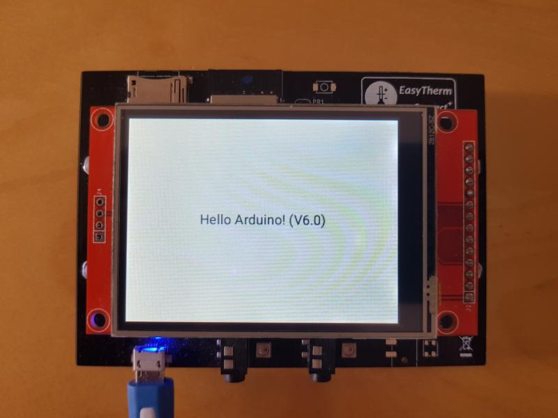

# LittlevGL Arduino library

This library allows to use LittlevGL (v6.x) as an Arduino library. Library can be installed via Arduino IDE Library Manager or as an .ZIP library.

## Example

There is simple example which uses https://github.com/Bodmer/TFT_eSPI library as an TFT driver to simplify testing. To get all this to work you have to setup TFT_eSPI to work with your TFT display type via editing the `User_Setup.h` file in TFT_eSPI library folder, or by selecting your own configurtion in the `User_Setup_Select.h` file in TFT_eSPI library folder.

LittlevGL library has its own configuration file in `lv_conf.h` file, which is locatd in LittlevGL library folder. Please get in mind to check that corresponding resolutions in LVGL configuration match the ones in TFT_eSPI and with physical resolution of your display.

Example result should look like this:



Tested with:

  * My own ESP32 board, module ESP32 Wroom
  * PC OS: Linux, Ubuntu 18.04 LTS
  * IDE: Arduino IDE 1.8.9
  * ESP32 Core: 1.0.2

## Debugging

In case of trouble there are debug information inside LVGL. In the `ESP32_TFT_eSPI` example there is `my_print` method, which allow to send this debug information to the serial interface. To enable this feature you have to edit `lv_conf.h` file and enable logging in section `log settings`:

```c
/*Log settings*/
#define USE_LV_LOG      1   /*Enable/disable the log module*/
#if USE_LV_LOG
/* How important log should be added:
 * LV_LOG_LEVEL_TRACE       A lot of logs to give detailed information
 * LV_LOG_LEVEL_INFO        Log important events
 * LV_LOG_LEVEL_WARN        Log if something unwanted happened but didn't caused problem
 * LV_LOG_LEVEL_ERROR       Only critical issue, when the system may fail
 */
#  define LV_LOG_LEVEL    LV_LOG_LEVEL_TRACE
```

After enabling log module and setting LV_LOG_LEVEL accordingly the output log is sent to he `Serial` port @ 115200 Bd. After each line sent there is 100ms delay to allow the serial transfer to finish. This delay can be commented out in `my_print` method.
